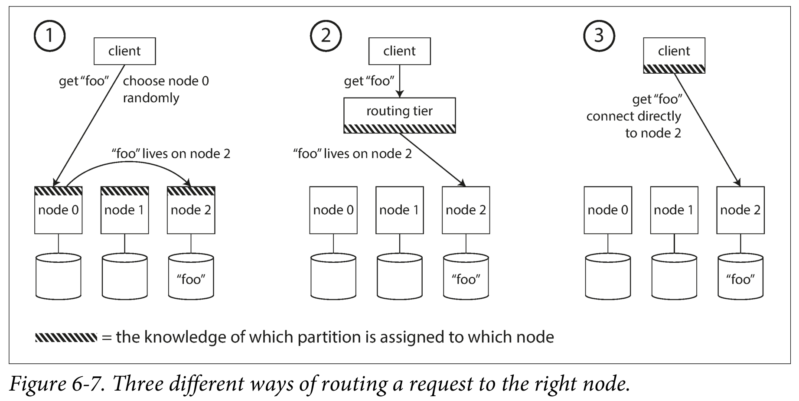
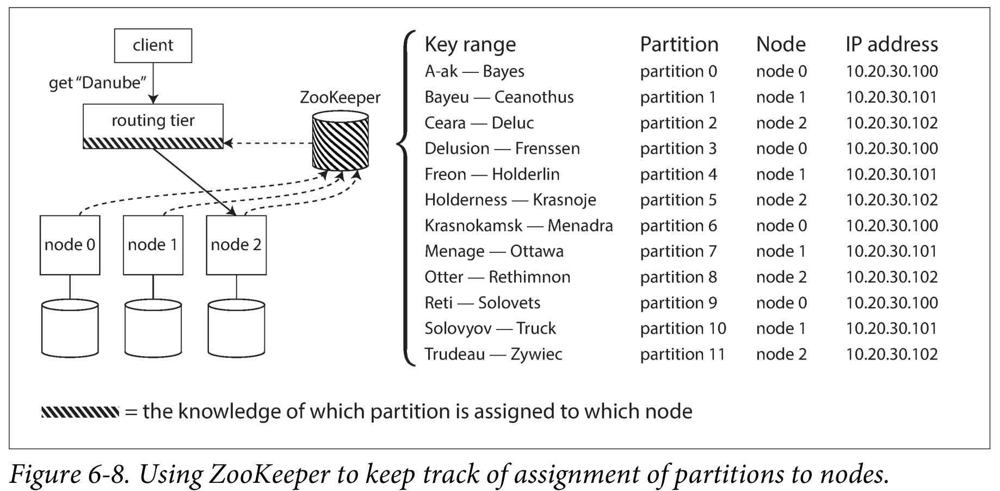
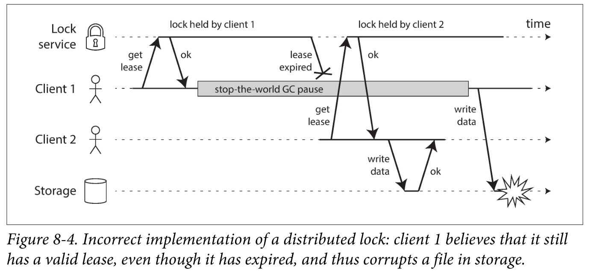
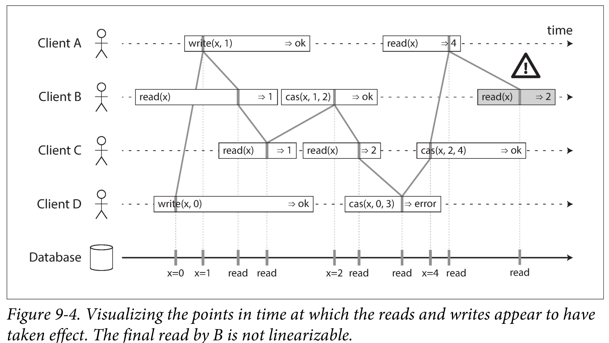
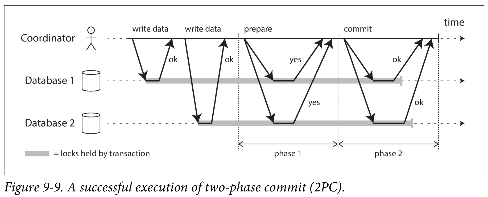
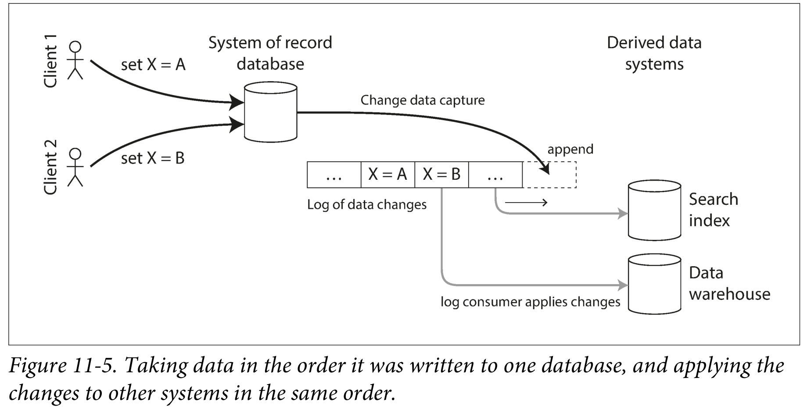

# Designing Data-Intensive Applications

## Part I. Foundations of Data Systems

Nonfunctional requirements: security, compliance, reliability, scalability, compatibility, maintainability.

### Chap 2. Data Models

Data Models:

+ Relational model
+ Document models (hierarchy, tree-like): JSON, XML
  + Not enforce a schema for the stored data.
  + Appropriate for 1-n relationships, not for n-n relationships.

+ Graph-Like models
  + Not enforce a schema for the stored data.
  + Targeting use cases where anything is potentially related to everything.

***MapReduce***: a programming model for processing large amounts of data in bulk
across many machines.

+  A limited form of MapReduce is supported by some NoSQL datastores including MongoDB.

### Chap 3. Storage & Retrieval

*Sorted String Table*

+ How to sort? Balanced tree or skip list.
+ Keys are sorted, so index can be sparse.

##### *Log-Structured Merge-Tree* (LSM-Tree)

+ Write faster than B-tree, read slower than B-Tree.
+ Example: *LevelDB*, *RocksDB*
+ LSM Tree是什么？ - 木鸟杂记的回答 - 知乎 https://www.zhihu.com/question/446544471/answer/3048704390

In-Memory Databases

+ Counterintuitively, the performance advantage of in-memory databases is not due to the fact that they don’t need to read from disk. Rather, they can be faster because they can avoid the **overheads of encoding in-memory data structures** in a form that can be written to disk 

OLAP && Data Warehouse

+ On a high level, storage engines fall into two broad categories:
  + OLTP - small number of records; 
  + OLAP (Data Warehouese) - large number of records, but less real-time
+ *column-oriented storage*: store all the values from each column together.

### Chap 4. Encoding and Evolution 

Programs usually work with data in at least 2 different representations:

1. In memory, data is kept in objects like arryas or trees.
2. Over the network, data are encoded as self-contained sequence of bytes (JSON, XML, etc.).

The translation from the in-memory representation to a byte sequence is called *encoding*.

JSON and XML are good and popular, but they also has some flaws. The difficulty of getting different organizations to agree on anything outweighs most other concerns.

Schemas inevitatbley need to change over time, which is called *schema evolution*.

#### Dataflow Through Services: REST and RPC

The API exposed by the server to clients is known as a *service*.

***Serviece-Oriented Architechture*** (SOA) or ***Microservices Architechture***: Decompose a large application into smaller services by area of functionality, such that one service makes a request to another when it requires some functionality or data from that other service.

Two popular approaches to web services: REST and SOAP:

+ *REST* is a design philosophy that builds upon the principles of HTTP, which emphasizes simple data formats using URLs.
  + Swagger can be used describe RESTful APIs and produce documentation.
+ *SOAP* is an XML-based protocol for making network API requests. Standardized but complicated.

***Remote Procedure Call*** (RPC)

+ A network request is very different from a local function call.
+ Service compatibility is made harder by the fact that RPC is often used for communication across organizational boundaries.

#### Message-Passing Dataflow

*Asynchronous messaeg-passng* systems:  

+ The message is not sent via a direct network connection, but goes via an intermediary called a ***message broker*** (also called a *message queue* or *message-oriented middleware*).
+ It can act as a buffer if the recipient is unavailable or overloaded, and thus improve system reliability.
+ Message brokers typically don’t enforce any particular data model—a message is just a sequence of bytes with some metadata, so you can use any encoding format.

## Part II. Distributed Data

Reasons for distribution: scalability, fault tolerance, latency.

### Chap 5 Replication

Popular algorithms for replicating changes between nodes:

+ single-master (no conflict to worry): MySQL, Oracle, PostgreSQL
+ multi-master (suitable for multi-datacenter)
+ masterless (suitable for multi-datacenter)

*Semi-synchronous*:

+ In practice, if you enable synchronous replication on a database, it usually means that one of the followers is synchronous, and the others are asynchronous.
+ If the synchronous follower becomes unavailable or slow, one of the asynchronous followers is made synchronous.
+ This guarantees that you have an up-to-date copy of the data on at least two nodes

Asynchronous --> eventual consistency, but not *read-yourself consistency* or *cross-device consistency*

strong consistency (synchronous) > monotonic reads > eventual consistency

In distributed systems, transactions are expensive in terms of performance and availability.

*Replication topology*: circular, star, all-to-all

##### Leaderless Replication

Clients send each write to several nodes, and read from several nodes in parallel
in order to detect and correct nodes with stale data.

Databases with appropriately configured **quorums** can tolerate the failure of individ‐
ual nodes without the need for failover. Each write from a client is sent to all replicas, regardless of datacenter, but the client usually only waits for acknowledgment from a quorum of nodes within its local datacenter so that it is unaffected by delays and interruptions on the cross-datacenter link. 

How to solve conflicts resulted from concurrent writes?

+ Last write wins (discarding concurrent writes, which is prone to *lost updates*)

How to decide whether two operations are concurrent or not?

+ An operation A happens *before* another operation B if B knows about A, or depends on A, or builds upon A in some way.
+ For defining concurrency, exact time doesn’t matter: we simply call two operations concurrent if they are both unaware of each other, regardless of the physical time at which they occurred.
+ The server determine whether two operations are concurrent by looking at the **version numbers**. We need to use a version number for each replica's each key.

### Chap 6  Partitioning

The main reason for partitioning: *scalability*

Each node should take a relatively fair share. If the partitioning is unfair,the partition with disproportionately high load is called a *hot spot*.

Two approaches to partioning:

+ *Key range partitioning*
+ *Hash partitioning*: Because of this risk of skew and hot spots, many distributed datastores use a **hash** function to determine the partition for a given key. A good hash function takes skewed data and makes it uniformly distributed. However, by using the hash of the key for partitioning, we lose the ability to do efficient range queires.

Each node can construct its secondary index locally, and also globally.

#### Rebalancing Partitions

Full automated rebalancing is convenient but dangerous. Data systems should have a human in the loop for rebanlancing.

#### Request Routing

How does the client making the routing decision learn about changes in the assignment of partitions to nodes?

Many distributed data systems rely on a seperate coordination service such as **ZooKeeper** to keep track of this cluster metadata. ZooKeeper maintains the authoritative mapping of partitions to nodes. Other actors, such as the routing tier or the partitioning-aware client, can subscribe to this information in ZooKeeper. Whenever a partition changes ownership, or a node is added or removed, ZooKeeper notifies the routing tier so that it can keep its routing information up to date. It leads to a dependency on the external service Zookeeper.

### Chap 7  Transactions

In practice, one database's implementation of ACID does not equal another's implementation. 

#### Weak Isolation Levels

Isolation levels are hard to understand, and inconsistently implemented in different databases. If you look at your application code, it’s difficult to tell whether it is safe to run at a particular isolation level.

##### Read Commited

To solve *dirty read* and *dirty write*.

Most commonly, databases prevent dirty writes by using row-level locks, and prevent dirty reads by remembering old values.

##### Snapshot Isolation

To solve *nonrepeatable read*. But cannot solve *phantom*.

*Snapshot Isolation*: each transaction reads from a consistent snapshot of the database. In MySQL, it is called *repeatable read*.

*Readers never block writers, and writers never block readers.*

To implement snapshop isolation, the database maitains several versions of an object side by side, which is known as *multiversion concurrency control* (MVCC). In MVCC. each row in a table has a `created_by` and `deleted_by` field, recording the ID of transactions. An update is internally translated into a delete and a create.

How do indexes work in a multi-version database? Some databases use *append-only* B-trees.

#### Serializability

It can guarantee that even though transactions may execute in parallel, the end result is the same as if they had executed one at a time, **serially**, without any concurrency., but reduces performance greatly.

3 techniques to achieve serializability:

+ Literally executing transactions in a serial order
+ Two-phase locking
+ Optimistic concurrency control

***Pessimistic concurrency control*** mechanism: based on the principle that if anything might possibly go wrong (as indicated by a lock held by another transaction), it’s better to wait until the situation is safe again before doing anything. E.g. serial execution, two-phase locking.

***Optimustic*** cucurrency control: transactions continue anyway, in the hope that everything will turn out all right. When a transaction wants to commit, the database checks whether anything bad happened (i.e., whether isolation was violated); if so, the transaction is aborted and has to be retried. Only transactions that executed serializably are allowed to commit.

+ performs badly if there is high contention (many transactions trying to access the same objects)

##### Actual Serial Execution

Executing all transactions serially makes concurrency control much simpler, but limits the transaction throughput of the database to the speed of a single CPU core on a single machine. Read-only transactions may execute elsewhere, using snapshot isolation, but for applications with high write throughput, the single-threaded transaction processor can become a serious bottleneck.

If you can find a way of **partitioning** your dataset so that each transaction only needs to read and write data within a single partition, then each partition can have its own transaction processing thread running independently from the others.

##### Two-Phase Locking (2PL)

2PL: Several transactions are allowed to concurrently read the same object as long as nobody is writing to it. But as soon as anyone wants to write (modify or delete) an object,
exclusive access is required. It is used by the serializable isolation level in MySQL InnoDB and SQL server.

2PL can have quite unstable latencies, and they can be very slow at high percentiles.

***Predicate lock***: rather than belonging to a particular object, but belongs to all objects that match some search condition, in order to overcame *phantom*.

+ If transaction A wants to insert, update, or delete any object, it must first check whether either the old or the new value matches any existing predicate lock. If there is a matching predicate lock held by transaction B, then A must wait until B has committed or aborted before it can continue.
+ The key idea here is that a predicate lock applies even to objects that do not yet exist in the database, but which might be added in the future (phantoms).
+ If there are many locks by active transactions, checking for matching locks becomes time-consuming.

***Index-range locks***: a simplified approximation of predicate locking with lower concurrency and lower overheads.

#### Serializable Snapshot Isolation (SSI)

On top of snapshot isolation, SSI adds an algorithm (index-range lock) for detecting serialization conflicts among writes and determining which transactions to abort. SSI is probably less sensitive to slow transactions than two-phase locking or serial execution.

### Chap 8  The Trouble with Distributed Systems

Anything that can go wrong will go wrong.

#### Unreliable Networks

If you send a request and don’t get a response, it’s not possible to distinguish whether (a) the request was lost, (b) the remote node is down, or (c) the response was lost.

Even if TCP acknowledges that a packet was delivered, the application may have crashed before handling it. If you want to be sure that a request was successful, you need a positive response from the application itself.

Asynchronous networks have *unbounded delays* (that is, they try to deliver packets as quickly as possible, but there is no upper limit on the time it may take for a packet to arrive). Network delays can be highly variable (which is a consequence of dynamic network resource partitioning), so you can only choose timeouts experimentally.

#### Unreliable Clocks

Each machine on the network has its own clock (decided by its actual hardware device, a quartz crystal oscillator), which are not perfectly accurate. The most commonly used mechanism to synchronize clocks is the **Network Time Protocol** (NTP), which allows the computer clock to be adjusted according to the time reported by a group of servers. The servers in turn get their time from a more accurate time source, such as a GPS receiver. However, NTP's synchronization acccuracy is itself **limited** by the network round-trip time.

Monotonic Versus Time-of-Day Clocks (Both are called *physical clocks*)

+ *Time-of-day* clocks are usually synchronized with NTP. However, it may sometimes by forcibly reset and appear to jump back to previous point in time.
+ *Monotonic clocks* measure durations. NTP may adjust the frequency at which the monotonic clock moves forward, but it cannot cause the monotonic clock to jump forward or backward.

*Logical clocks*

+ not measure the time of day or the number of seconds elapsed, only the relative ordering of events

If you use software that requires synchronized clocks, it is essential that you also carefully monitor the clock offsets between all the machines. There are some problems with the *last write wins* strategy:

+ Database writes can mysteriously disappear: a node with a lagging clock is unable to overwrite values previously written by a node with a fast clock until the clock skew between the nodes has elapsed.
+ LWW cannot distinguish between writes that occurred sequentially in quick succession and writes that were  concurrent. Additional causality tracking mechanisms, such as version vectors, are needed in order to prevent violations of causality.

##### Process Pauses

A node in a distributed system must assume that its execution can be **paused** for a significant length of time at any point, even in the middle of a function. When writing multi-threaded code on a single machine, we have fairly good tools for making it thread-safe: mutexes, semaphores, atomic counters, lock-free data structures, blocking queues, and so on. Unfortunately, these tools don’t directly translate to distributed systems.

 

#### Truth & Lies in Distributed Systems

**The truth is defined by the majority**. A distributed system cannot exclusively rely on a single node, because a node may fail at any time, potentially leaving the system stuck and unable to recover. Instead, many distributed algorithms rely on a *quorum*, that is, voting among the nodes.

In this book we assume that nodes are unreliable but honest. Distributed systems problems become much harder if there is a risk that nodes may "lie".

Safety and liveness properties and system models are very useful for reasoning about the correctness of a distributed algorithm.

+ *synchronous model*, *partially synchronous model*, *asynchronous model*
+ *crash-stop faults*, *crash-recovery faults*, *byzantine (arbitrary) faults*

### Chap 9  Consistency & Consensus

#### Linearizability

*linearizability* (also known as *atomic consistency*, or *immediate consistency*)'s basic idea is to make a system appear as if there were only one copy of the data, and all operations on it are atomic. 

+ The execution history is linearizable if there exists an total order of operations that matches real-time for non-concurrent requests and each read sees the most recent write in the order.
+ Although linearizability is a useful guarantee, surprisingly few systems are actually linearizable in practice, for the sake of performance.

In a linearizable system, operations are totally orderd (全序), so there's no real concurrency. In a non-linearizable system, operations are partially ordered (偏序).

Note: linearizability != serializability

+ actually, serializable snapshopt isolation (SSI) is not linearizable.

Why linearizability?

+ Leader election, e.g. Apache ZooKeeper.
+ Uniqueness guarantees
+ Cross-channel timing dependencies

How to implement linearizability？

+ Single-leader replication: potentially linearizable
+ *Consensus algorithms*: linearizable, e,g, ZooKeeper
+ Multi-leader replication: not linearizable
+ Leaderless replication: probably not linearizable

#### Ordering Guarantees

Orders help preserve *causality*.

*Lamport timestamp*: (*counter*, node ID)

##### Total Order Broadcast

***State machine replication***: if every message represents a write to the database, and every replica processes the same writes in the same order, then the replicas will remain consistent with each other.

*Total Order Broadcast*: all nodes must deliver the same messages in the same order, all nodes can read the log and see the same sequence of  messages. But how all nodes can agree on the same order?

#### Distributed Transactions and Consensus

**Consensus** is one of the most important and fundamental problems in distributed computing. Theoratically speaking, consensus is impossible in a unreliable network (FLP result). In practice, the system can only try its best to achieve consensus.

In a distributed transactions, a node must only commit once it is certain that all other nods in the transaction are also going to commit.

##### Two-Phase Commit (2PC)

The protocol contains two crucial "points of no return": when a participant votes "yes", it promises that it will definitely be able to commit later (although the coordinator may still choose to abort); and once the coordinator decides, that decision is irrevocable. However, if the coordinator crashed after the nodes said "yes", nodes will fall into an uncertain state (namely, in-doubt), and they have to wait for the coordinator to recover.

##### Distributed Transactions in Practice

Some implementations of distributed transactions carry a heavy performance penalty—for example, distributed transactions in MySQL are reported to be over 10 times slower than single-node transactions.

*X/ Open XA* is a standard for implementing 2PC across heterogeneous technologies (e.g. 2 different MBS). It is widely supported by retional databases (MySQL, PostgreSQL, Oracle).

XA assumes that your application uses a network driver or client library to communicate with the participant databases or messaging services. If the driver supports XA, that means it calls the XA API to find out whether an operation should be part of a distributed transaction—and if so, it sends the necessary information to the database server. The driver also exposes callbacks through which the coordinator can ask the participant to prepare, commit, or abort.

##### Fault-Tolerant Consensus

It can be proved that any consensus algorithm requires at least a **majority** of nodes to be functioning correctly.

Fault-Tolerant consensus algorithms: VSR, Paxos, **Raft**, etc. They are also *total order broadcast* algorithms, which requires messages to be delivered,  exactly **once in the same order, to all nodes**.

Consensus systems always require a strict majority to operate. Consensus algorithms are particularly sensitive to network problems. 

## Part III.  Derived Data

Systems that store and process data can be grouped into two broad categories:

+ *Systems of record*
+ *Derived data systems*

### Chap 10  Batch Processing

3 different ways of building systems:

+ *Services (online systems)*, e.g. HTTP/REST-based APIs
+ *Batch Processing Systems (offline systems)*
+ *Stream processing systems (near-real-time systems)*

#### MapReduce

**MapReduce** is a programming framework with which you can write code to process
large datasets in a distributed file system like **HDFS** (Hadoop Distributed File Systems). In Hadoop's implementation of MapReduce, the filesystem is called HDFS, an open source implementation of the Google File System (GFS), which is based on the *shared-nothing* principle.

A batch job’s output is only considered valid when the job has completed successfully (MapReduce discards the partial output of a failed job). Thanks to the framework, your code in a batch processing job does not need to worry about implementing fault-tolerance mechanisms: the framework can guarantee that the final output of a job is the same as if no faults had occurred.

To handle these dependencies between job executions, various workflow schedulers for Hadoop have been developed, including Oozie, Azkaban, Luigi, Airflow, and Pinball. 

#### Beyond MapReduce

The process of writing out this intermediate state to files is called ***materialization***. An advantage of fully materializing intermediate state to a distributed filesystem is that it is **durable**, which makes fault tolerance fairly easy in MapReduce: if a task fails, it can just be restarted on another machine and read the same input again from the filesystem.

Other distirbuted data engines like **Spark** avoid writing intermediate state to HDFS, so they take a different approach to tolerating faults: if a machine fails and the intermediate state on that machine is lost, it is recomputed from other data that is still available. However, when recomputing data, it is important to know whether the computation is **deterministic**: that is, given the same input data, do the operators always produce the same output?

Many programming languages do not guarantee any particular order when iterating over elements of a hash table, many probabilistic and statistical algorithms explicitly rely on using random numbers, and any use of the system clock or external data sources is nondeterministic. Such causes of nondeterminism need to be removed in order to reliably recover from faults, for example by generating pseudorandom numbers using a fixed seed.

### Chap 11  Stream Processing

In a stream processing context, a record is more commonly known as an ***event***. An event is generated once by a *producer* (*publisher*) and then potentially processed by multiple *consumers* (or *subscribers*). A common approach for notifying consumers about new events is to use a ***messaging system***.

What happens if the producers send messages faster than the consumers can process them? Broadly speaking, there are three options: 

+ drop messages
+ buffer messages in a queue
+ apply *backpressure* (flow control)

Messaging systems:

+ Direct messaging from producers to consumers: RPC, HTTP, UDP, etc.
+ ***Message Brokers***: a kind of database that is optimized for handling message streams, which runs as a server with producers and consumers connecting to it as clients.
  + By centralizing the data in the broker, these systems can more easily tolerate clients that come and go (connect, disconnect, and crash), and the question of durability is moved to the broker instead.
  + Two main patterns of messaging are used: *Load Balancing* and *Fan-out*

#### Databases and Streams

*Change Data Capture*:

We don't have to store the entire log history, we can just start with a consistent **snapshot** (like Lab2 Raft). The snapshot of the database must correspond to a known position or offset in the change log.

The contents of the database hold a caching of the latest record values in the logs. **The truth is the log**. The database is a cache of a subset of the log. That cached subset happens to be the latest value of each record and index value from the log. 

With an **append-only** log of **immutable** events, it is much easier to diagnose what happened and recover from the problem. Moreover, by separating mutable state from the immutable event log, you can derive several **different read-oriented representations** from the same log of events. This works just like having multiple consumers of a stream

To what extent is it feasible to keep an immutable history of all changes forever? The answer depends on the amount of churn in the dataset. Some workloads mostly add data and rarely update or delete; they are easy to make immutable.

##### Fault Tolerance

*Exactly-once Semantics*: In stream processing settings, each record should be processed exactly once.

In **Spark**, streams are broken into small blocks and each block is treated like a miniature batch process. This approach is called *microbatching*. Within the confines of the stream processing framework, the microbatching and checkpointing approaches provide the same exactly-once semantics as batch processing. However, as soon as output leaves the stream processor.

### Chap 12  The Future of Data System

The most appropriate choice of software tool also depends on the circumstances.

##### Derived data v.s. distributed transactions 

The classic approach for keeping different data systems consistent with each other involves ***distributed transactions*** and derived data systems like ***change data captures*** (CDC). Distributed transactions use atomic commit to ensure that change take effect exactly once, while CDC are based on deterministic retry and idempotence. The biggest difference is that transaction systems usually provide linearizability, which implies useful guarantees such as reading your own writes, while derived data systems are often updated asynchronously. Since distributed transactions have poor fault tolerance and performance, log-based derived data is the most promissing approach.

##### The limits of total ordering

With systems that are small enough, constructing a totally ordered event log is entirely feasible. However, as systems are scaled toward bigger and more complex workloads, limitations begin to emerge. In formal terms, deciding on a total order of events is known as ***total order broadcast***, which is equivalent to consensusIt is still an open research problem to design **consensus algorithms** that can scale beyond the throughput of a single node and that work well in a geographically distributed setting.

##### Stream processors and services

The currently trendy style of application development involves breaking down functionality into a set of ***services*** that communicate via synchronous network requests such as REST APIs. The advantage of such a service-oriented architecture over a single monolithic application is primarily organizational scalability through loose coupling: different teams can work on different services, which reduces coordination effort between teams. 

Neverthess, the fastest and most reliable network request is actually no network request at all. **Subscribing to a stream of changes**, rather than querying the current state when needed, brings us closer to a spreadsheet-like model of computation: when some piece of data changes, any derived data that depends on it can swiftly be updated.

##### Trust, but Verify

Traditionally, system models take a binary approach toward faults: we assume that some things can happen, and other things can never happen. In reality, it is more a question of probabilities: some things are more likely, other things less likely. The question is whether violations of our assumptions happen often enough that we may encounter them in practice.

Checking the integrity of data is known as ***auditing***. Mature systems similarly tend to consider the possibility of unlikely things going wrong, and manage that risk. For example, large-scale storage systems such as HDFS and Amazon S3 do not fully trust disks.
