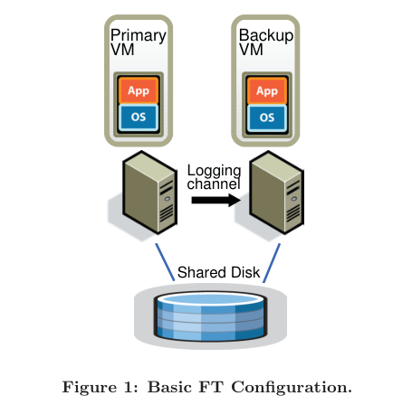
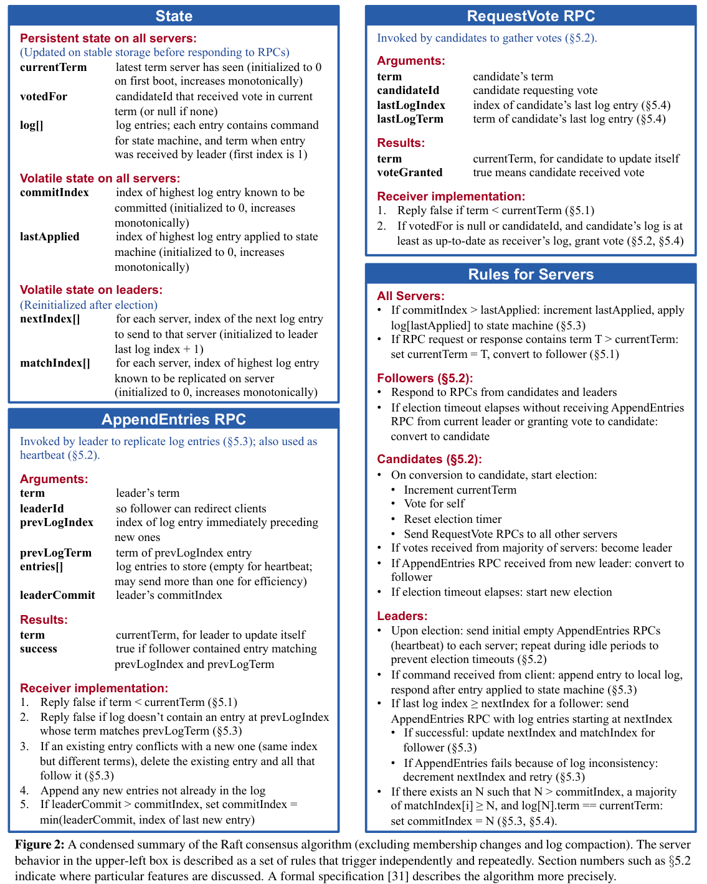
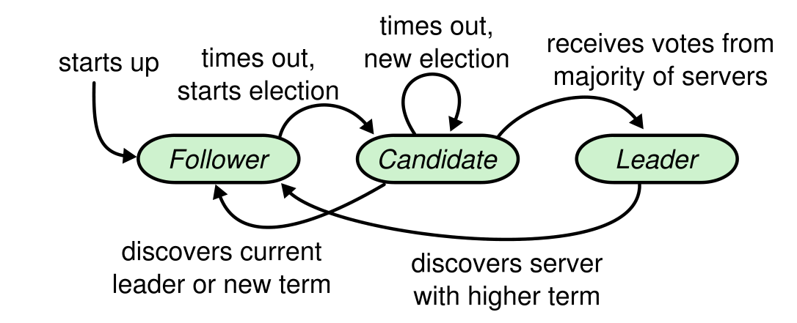
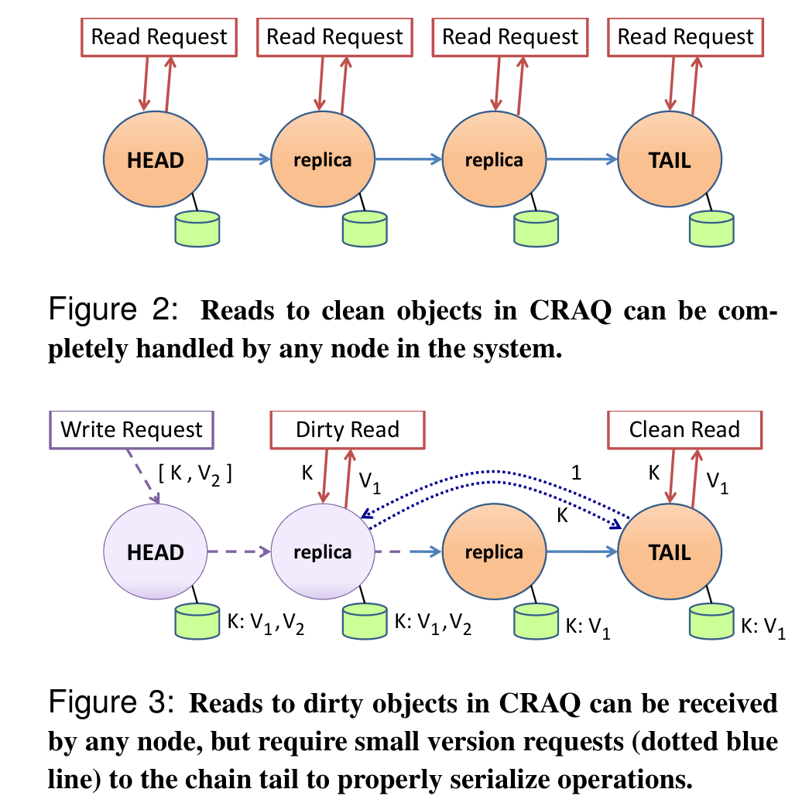
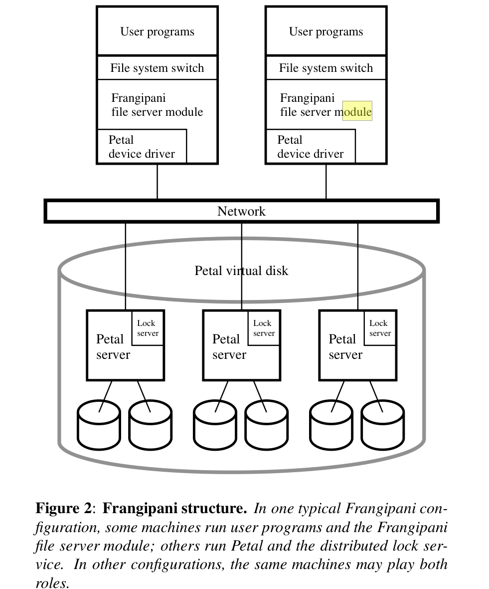
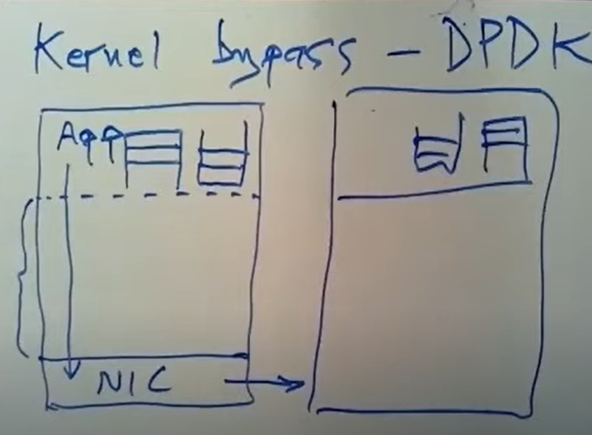

# MIT 6.824

## Lecture 4  Fault-Tolerant (FT) Virtual Machine

Two types of replications:

+ State transfer (replicate the whole state)
+ ***Replicated state machine*** (replicate the new input which leads to state transfer)
  + More efficient but less robost
  + A **virtual machine** (VM) running on top of a hypervisor is an excellent platform for implementing the state-machine approach. A VM can be considered a well-defined state machine. A FT VM is an OS-level replication, rather than application level.

Since most servers or services have some operations (such as reading the clock cycle counter of the processor and IO completion interrupts) that are not **deterministic**, extra coordination must be used to ensure that a primary and backup are kept in sync.

The production replaying supports **only uni-processor**. Multi-processor is not supported, since nearly every access to shared memory can be a non-deterministic operation.

#### 2.  Basic FT Design

Shared vs. Non-shared Disk: shared disk is less complicated, but the primary and backup cannot be too far apart.

##### 2.1  Deterministic Replay Implementation

If two deterministic state machines are started in the same initial state and provided the exact same inputs in the same order, then they will go through the same sequences of states and produce the same outputs. 

VMware ***deterministic replay*** records the inputs of a VM and all possible non-determinism associated with the VM execution in a stream of **log entries** written to a log file. The VM execution may be exactly replayed later by reading the log entries from the file.

##### 2.2  FT Protocol

Instead of writing the log entries to disk, we send them to the backup VM via the ***logging channel***.

**Output Requirement**: if the backup VM ever takes over the primary, the backup VM will continue executing in a way that is entirely consistent with all outputs that the primary VM has sent to the external world.

**Output Rule**: the primary VM may not send an output to the external world, until the backup VM has received and *acknowledged* the log entry associated with the operation producing the output.

##### 2.3  Detecting and Responding to Failure

A failure is declared if heartbeating or logging traffic has stopped for longer than a specific timeout.

The time for the backup to *go live* is roughly equal to the failure detection time plus the current execution lag time. If the backup VM continues to lag behind, we continue to gradually reduce the primary VM's CPU limit.

## Lecture 6 & 7  Raft

*Raft*: a consensus algorithm for managing a replicated log.

##### 5.2 Leader Election

length of election timer:

+ minimum: heartbeat interval
+ maximum: determined by the upper bound of recovery time

##### 5.3 Log Replication

A log entry is **committed** once the leader that created the entry has replicated it on a **majority** of the servers. The leader keeps track of the highest index it knows to be committed, and it includes that index in future AppendEntries RPCs (including heartbeats) so that the other servers eventually find out. Once a follower learns that a log entry is committed, it applies the entry to its local state machine (in log order).

#### Lab 2  Implementation

Some irratating bugs in my implementations:

+ Each time a LEADER appends, commits, or applies a new entry, broadcast it immediately.
+ Each time a server switches to FOLLOWER, it must reset the election timer.
+ Each time a LEADER receive a failed AppendEntries reply, resend AppendEntries immediately. 
+ If using *channel* to implement asynchronous applier, pay attention to avoiding deadlocks!
+ Before sending out a AppendEntries RPC, make sure that the sender is still a LEADER!

## Lecture 8  ZooKeeper

***Linearizability***: The execution history is linearizable if there exists an total order of operations that matches real-time for non-concurrent requests and each read sees the most recent write in the order.

Why ZooKeeper?

+ API for general purpose
+ achieve n-time performance with n-time CPU

ZK Guarantees:

+ **Linearizable Write**s (not read): all requests that update the state of ZooKeeper are serializable and respect precedence.
+ **FIFO client Order**: all requests from a given client are executed in the order that they were sent by the client.

Because only update requests are linearizable, ZooKeeper processes read requests locally at each replica. This allows the service to scale linearly as servers are added to the system. ZooKeeper implements **watches** to allow clients to receive timely notifications of changes without requiring polling.

## Lecture 9  CRAQ

*CRAQ*: Chain Replication with Apportioned Queries

When a node is down, its successor and predecessor will connect each other to remove the down node. However, in the down node's perspective, all other nodes get down, so it will try to transform itself both HEAD and TAIL. This leads to **split brain** problem, which bring the need for an externel manager (maybe running on Raft, which is fault-torlerent).

## Lecture 10  Cloud Replicated DB, Aurora

Amazon Aurora is **not** a general-purpose storage system, since it must know how to rebuild the replica with **only log entries**. (There is a trade-off between performance and usability)

Aurora's F.T. goals:

+ be able to Write with one dead AZ
+ be able to Read with one dead AZ and one another server
+ fast Re-replication

Quorum: W + R > N (to read the most recent write)

## Lecture 11  Frangipani: A Scalable Distributed File System

Frangipaniis a new scalabledistributed file systemthat manages a collection of disks on multiple machines as a single shared pool of storage.

##### 4. Logging and Recovery

All the file servers read and write the same file system data structures on the shared Petal disk, but each server keeps its own redo log of pending changes in a distinct section of the Petal disk. The logs are kept in Petal so that when a Frangipani server crashes, another server can access the log and run recovery.

If a Frangipani server crashes, the system eventually detects the failure and runs recovery on that server’s log. Failure may be detected either by a client of the failed server, or when the lock service asks the failed server to return a lock it is holding and gets no reply.

Only metadata is logged, not user data, so a user has no guarantee that the file system state is consistent from his point of view after a failure.

##### 5. Synchronization and Cache Coherence

Frangipani uses **multiple-reader/single-writer locks** to implement the necessary synchronization. When the lock service detects conflicting lock requests, the current holder of the lock is asked to release or downgrade it to remove the conflict.

A write lock allows a server to read or write the associated data and cache it. A server’s
cached copy of a disk block can be different from the on-disk version only if it holds the relevant write lock. Thus if a server is asked to release its write lock or downgrade it to a read lock, it must write the dirty data to disk before complying.

## Lecture 12  Distributed Transactions

Concurrency Control:

1. Pessimistic: used when conflicts are frequent
   + Two-Phase Locking
2. Optimistic: avoid lock overhead

In distributed settings: Two-Phase Commit

2PC is used only in small organizations due to its poor performance.

## Lecture 13  Spanner

Spanner is Google's scalable, **multi-version**, **globally-distributed**, and synchronously-replicated database. It is the first system to distribute data at global scale and support **externally-consistent distributed transactions**.

Used for datacenters spread all over the world, each of which has multiple shards of data. A Paxos, which provides fault-tolerance, is built on all shards with the same data on each datacenter.

For read&write transactions, it uses standard 2PL and 2PC, which guarantees serializability but results in high latency.

For read-only transactions, it does not adopt 2PL or 2PC, but uses some complicated protocols:

+ Constraints:
  + Serializability: reads should not be influenced by concurrent write transactions.
  + Externel Consistency: a client should always read the most recent written data (not including concurrently written data necessarily) and never read stale data.
+ It adopts **Snapshot Isolation** with timestamps (ts) to realize the above characteristics.
  + Multi-Version Concurrency Control
  + Read will be delayed if its timestamp is more recent than the replica server's timestamp. It will wait until Paxos server updates the replica to a newer version.

Clock Synchronization by GPS satelites

+ Use confidence interval for clock timestamp *(Earliest, Latest)* to solve clock uncertainty.
+ Transation Start Rule:
  + When a r-only xactions starts, `ts = now().Latest`
  + When a r/w xactions commits, `ts > now().Latest`, and `ts >= preparation ts of each replica`
+ R/W Transaction Commit Wait:
  + After commit, wait until `ts < now().Earliest` to wait out time uncertainty, and then apply the commit log entry.

## Lecture 14  FaRM, Optimistic Concurrency Control

All replicas in the same datacenter

FaRM adopts **non-volatile RAM**s (which use batteries to provide electricity during power failtures) rather than disks to store data.

RDMA - Remote Direct Memory Access:

+ Kernel Bypass - the application communicates with the NIC directly

Optimistic Concurrency Control 

+ read without locks
+ buffer write until commit validation (if conflicts, abort)
+ OCC is better than pessimitic-CC in FaRM, because reads with RDMA is extraordinarily efficient.

## Lecture 15  Resilient Distributed Datasets & Spark

We present **Resilient Distributed Datasets** (RDDs), a **distributed memory abstraction** that lets programmers perform in-memory computations on large clusters in a fault-tolerant manner. 

RDDs are best suited for **batch** applications that apply the same operation to all elements of a dataset.  In these cases, RDDs can efficiently remember each transformation as one step in a **lineage graph** and can recover lost partitions without having to log large amounts of data.

## Lecture 16  Cache Consistency: Memcached at Facebook

*Memcached* is a well known, simple, in-memory caching solution. This paper describes how Facebook leverages *memcached* as a building block to construct and scale a distributed key-value store that supports the world’s largest social network.

## Lecture 18  Fork Consistency, SUNDR

Topic: 

+ Decentralized systems
+ Byzantine participants: participants may disobey the protocay
+ Integrity

Big Idea: signed logs of operations

+ Each log entry contains signatures of the current record as well as all the proceeding records.

***SUNDR*** is a network file system designed to store data securely on **untrusted servers**. SUNDR lets clients detect any attempts at unauthorized file modification by malicious server operators or users. SUNDR’s protocol achieves a property called ***fork consistency***, which guarantees that clients can detect any integrity or consistency failures as long as they see each other’s file modifications. SUNDR cryptographically protects all file system contents so that clients can detect any unauthorized attempts to change files.

SUNDR’s protocol lets clients detect unauthorized at- tempts to modify files, even by attackers in control of the server. When the server behaves correctly, a fetch reflects exactly the authorized modifications that happened before it. We call this property *fetch-modify consistency*.

#### A straw-man file system (a roughest approximation of SUNDR)

The straw-man file server stores a complete, ordered list of every fetch or modify operation ever performed. Each operation also contains a digital signature from the
user who performed it. The signature covers not just the operation but also the **complete history of all operations that precede it**.

## Lecture 19  Bitcoin

